# Flutter Tracker

A Family Tracker for Flutter. This project is only an exercise in re-creating a propular family tracker using Flutter and should not be used for production purposes.

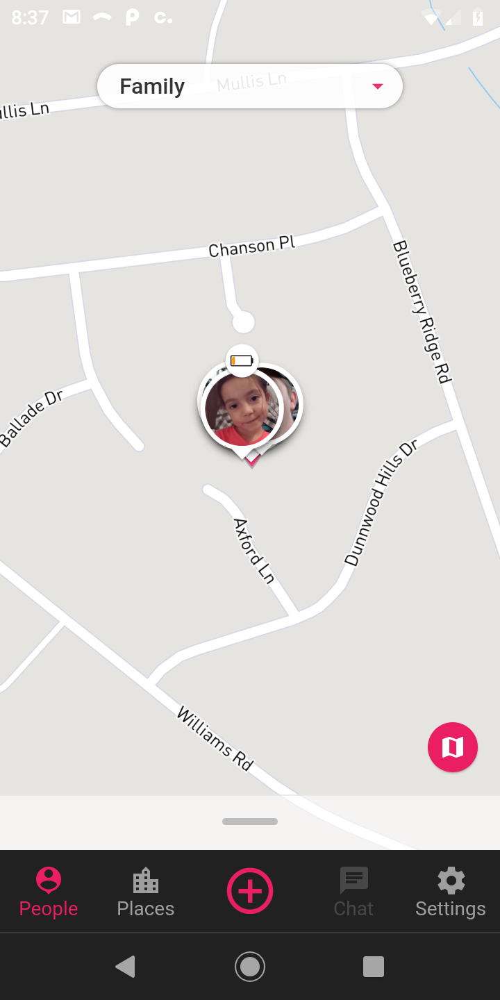

# Firebase

Firebase and firestore are required to run this so make sure to setup a new project.

---

# Style Guide

https://github.com/flutter/flutter/wiki/Style-guide-for-Flutter-repo

---

# VSCode

You will need to install the Dart and Flutter plugins.

  


## launch.json

```json
{
  "version": "0.2.0",
  "configurations": [
    {
      "name": "Flutter_Tracker_DEV",
      "type": "dart",
      "request": "launch",
      "program": "lib/main_dev.dart",
      "args": [
        "--flavor",
        "development"
      ]
    },
    {
      "name": "Flutter_Tracker_PROD",
      "type": "dart",
      "request": "launch",
      "program": "lib/main_prod.dart",
      "args": [
        "--flavor",
        "production"
      ]
    }
  ]
}
```

---

# Settings

You will need to create these files:

**android/key.properties**

```bash
storePassword=<store password>
keyPassword=<key password>
keyAlias=key
storeFile=<path/to/key/file.jks>
```

**android/local.properties**

```bash
app.id=io.flutter_tracker.app
flutter.buildMode=release
flutter.versionName=1.0.0
flutter.versionCode=1
flutter.sdk=<path/to/flutter/sdk>
sdk.dir=<path/to/android/sdk>
transistorsoft.license=<transistorsoft license key>
```

---

# Google Services

You will need to add your firebase services json config into the following folders. You can find this file in your firebase project settings.

```bash
android/app/src/development
android/app/src/production
```

---

# Android SDK

You will need to download, unzip the android sdk and update the _ANDROID_HOME_ env var with the path.

https://developer.android.com/studio#downloads  
Scroll down to the **Command line tools only** section.

**NOTE:** You **DO NOT** need to download Android Studio.

# Java

Java 8 is requried. It seems that the andorid sdk does not support Java 11 yet.

---

# Environment Variables

```bash
export JAVA_HOME=/usr/lib/jvm/java-1.8.0-openjdk-amd64
export ANDROID_HOME=$HOME/android/sdk
export PATH=$PATH:$JAVA_HOME:$JAVA_HOME/bin:$ANDROID_HOME/tools/bin:$ANDROID_HOME/platform-tools:$HOME/dev/flutter/bin:$HOME/dev/flutter/bin/cache/dart-sdk/bin
```

---

# Build App Bundle

```bash
flutter build appbundle --flavor development -t lib/main_dev.dart
```

```bash
flutter build appbundle --flavor production -t lib/main_prod.dart
```

```bash
flutter build appbundle --flavor production --release -t lib/main_prod.dart
```

---

# Build APK

```bash
flutter build --flavor development -t lib/main_dev.dart
```

```bash
flutter build --flavor production -t lib/main_prod.dart
```

```bash
flutter build --flavor production --release -t lib/main_prod.dart
```

---

# Run and debug

## Command line

```bash
flutter run --flavor development -t lib/main_dev.dart
```

```bash
flutter run --flavor production -t lib/main_prod.dart
```

---

## VSCode

Plug an android device into your computer and enable usb debugging. Next, open the project in VSCode. If everything is setup correctly then you'll see the Flutter version and your device shown at the bottom.


Now just press _F5_ and it will build and launch the app on your device. This menu will also appear in the window:

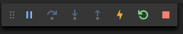

---

# Docker

```bash
docker-compose up flutter_tracker
```

---

# Screenshots

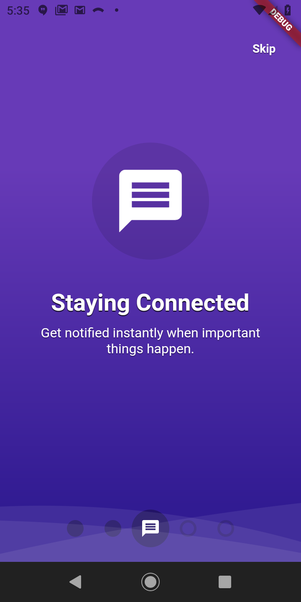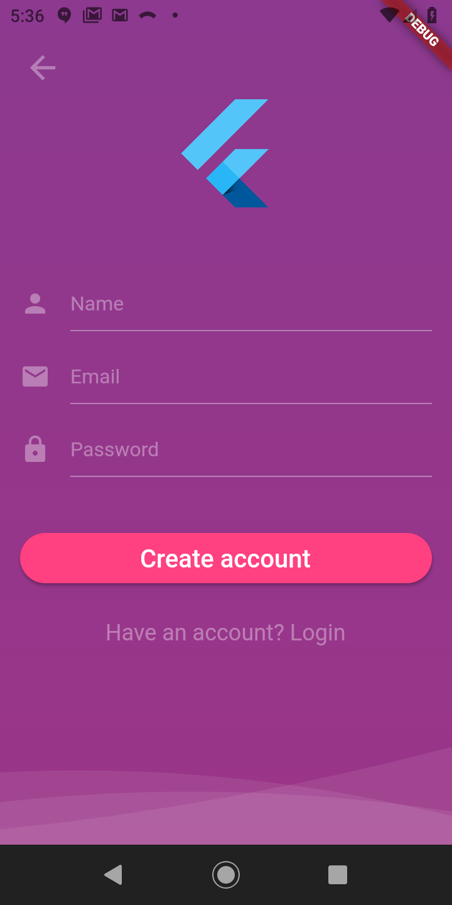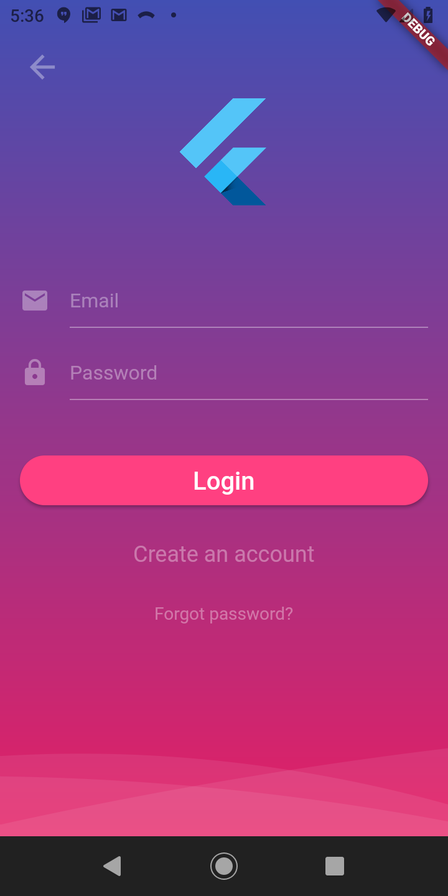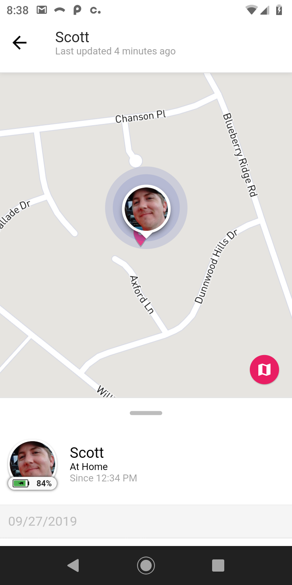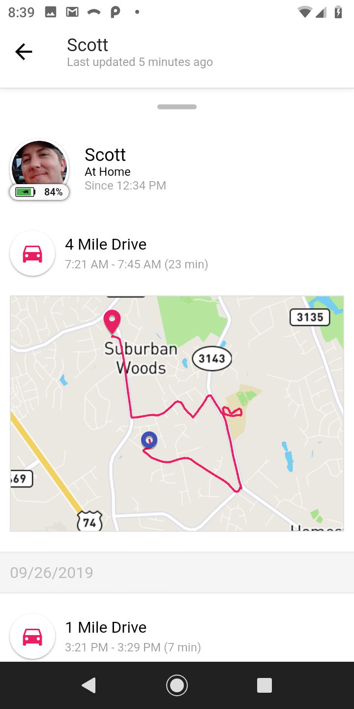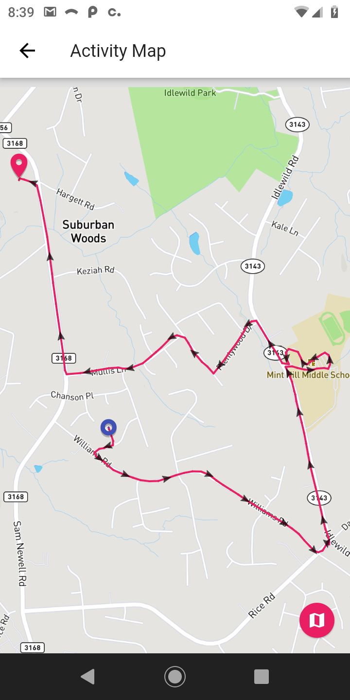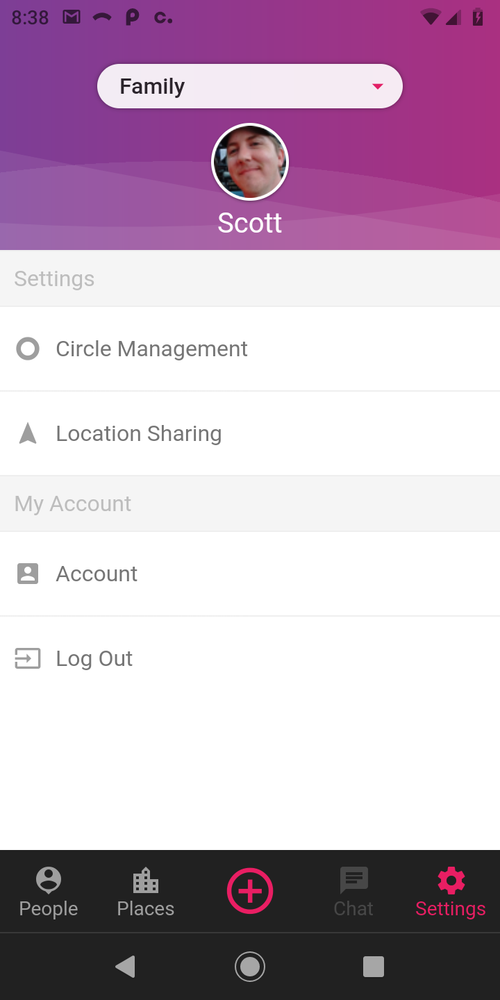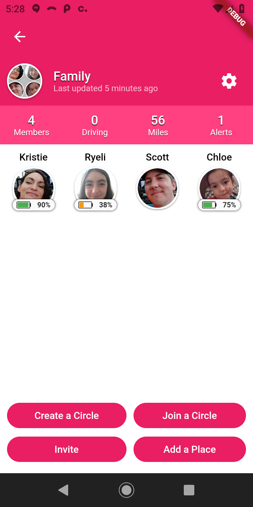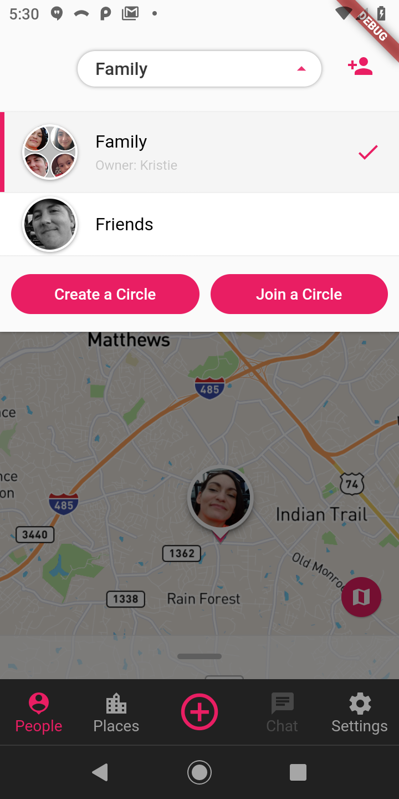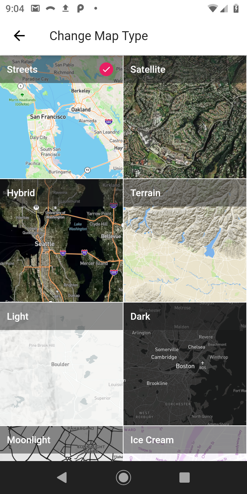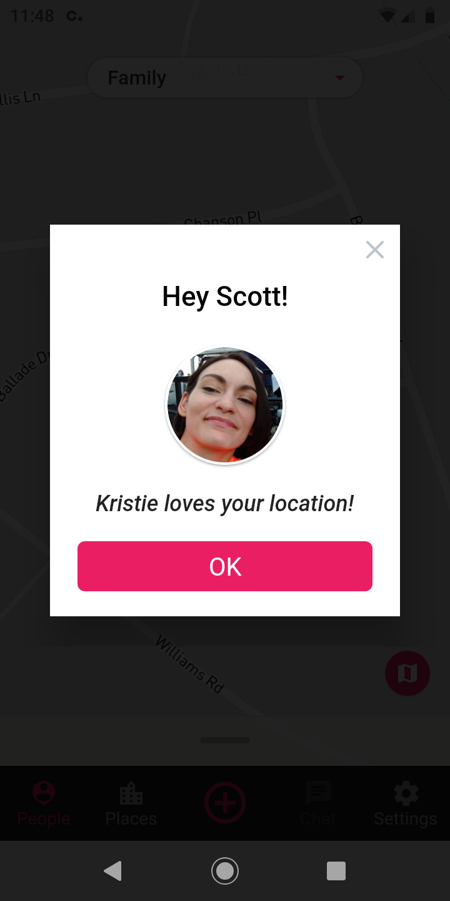
